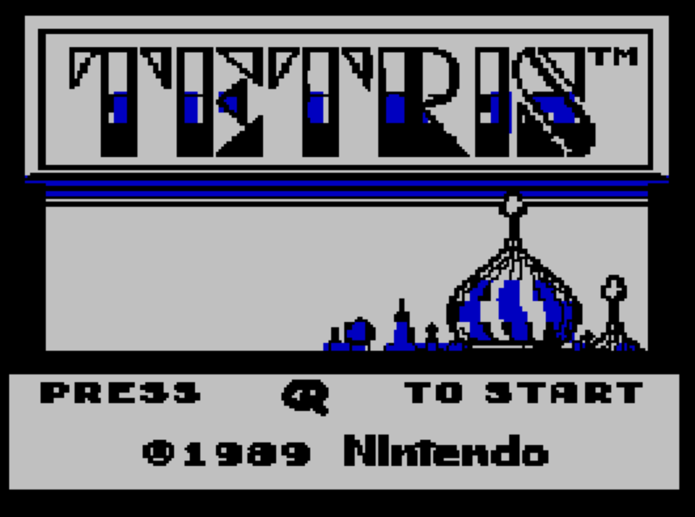
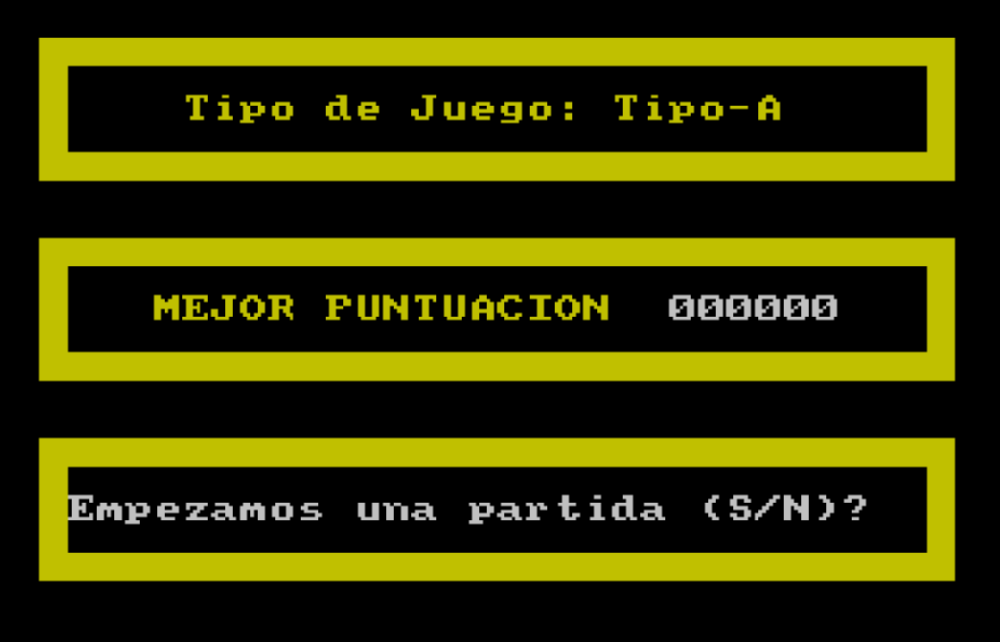
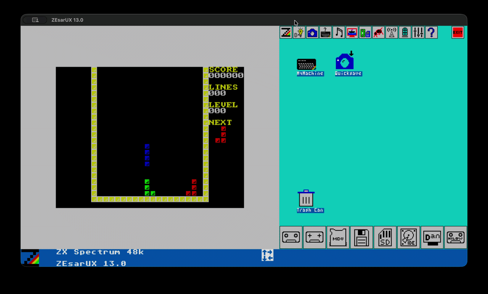

# TETRIS_Z80

A complete, working implementation of Tetris in Z80 assembly for the **ZX Spectrum 48K**.

Pieces spawn, fall, move, and rotate with wall kicks; completed rows clear and the stack
compacts down; score, line count, and level are tracked and displayed; gravity speeds up
as the level rises; a next-piece preview is shown; and game over reaches an end screen and
restarts cleanly. The attribute file at `$5800` — the Spectrum's 32×24 grid of per-character
colour bytes — doubles as the board: a cell counts as occupied precisely when its attribute
byte is non-zero, and every draw, erase, and collision check reads or writes that same file.

## Screenshot







> These images predate the screen redesign (unified panel style, fill animation, session-best
> score) and should be recaptured.

## How to play

1. **Title screen** — press **Q** to dismiss it.
2. **Start menu** — press **S** to start a game, or **N** to quit ("Gracias por jugar").
3. A piece appears at the top of the well and falls on its own.
4. **J** / **K** move the piece left / right, one cell per press. Hold **SPACE** to soft-drop
   (fall faster); release to return to normal speed.
5. **Q** / **W** rotate the piece left / right (with wall kicks against the border and
   settled blocks).
6. Fill an entire row (all 18 interior columns) to clear it — everything above drops down
   one row, and score/lines update. Every 10 cleared lines, the level increments and the
   fall speeds up.
7. When the stack reaches the top, the well fills with cycling colours from the bottom up,
   then the game-over screen appears showing "Juego Terminado!", your session-best score,
   and "Reiniciar el juego (S/N)?". Press **S** to play again — score, board, level, and
   lines all reset, though the session-best score does not — or **N** to quit
   ("Gracias por jugar").

## Features

- **Falling pieces** — all seven tetromino shapes, spawned from a uniform random draw (an
  LFSR-seeded selector), each with a distinct colour.
- **Movement and rotation** — left/right movement and two-directional rotation, both
  collision-checked before anything is drawn; rotation includes wall kicks so pieces don't
  overlap the well border or settled blocks.
- **Soft drop** — holding **SPACE** drops the piece at a faster, independent gravity rate;
  releasing it returns to normal speed immediately.
- **Non-blocking input** — key reads are edge-detected once per frame; holding a key doesn't
  repeat the action or freeze gravity, unlike the school-project original.
- **Line clearing** — full rows are detected, cleared, and everything above compacts downward.
- **Scoring and levels** — packed-BCD score, a line counter, level-up every ten lines, and a
  frames-per-row speed table so gravity accelerates with level.
- **Session-best score** — the highest score reached this session is tracked and shown on
  both the pre-game and game-over screens; it survives a restart, unlike the rest of the
  scoreboard.
- **Next-piece preview** — a preview box shows the piece that will spawn next.
- **Game over and restart** — stacking to the top reaches a proper game-over screen with a
  restart prompt; **S** restarts with the score, board, level, and lines reset, **N** quits.
- **Loss fill animation** — before the game-over screen appears, the well fills with cycling
  tetromino colours from the bottom up.
- **Frame-synced timing** — the fall loop is `HALT`-synced to the 50 Hz interrupt rather than
  a busy-wait, so speed is consistent regardless of emulator or hardware speed.
- **Background music** — Korobeiniki, the Type-A Tetris theme, plays throughout on the ZX
  Spectrum beeper, pausing only on the frame a line clears.

For the full, file-by-file account of what's implemented and why — including the defects
found in the original school submission and how each was fixed — see `AUDIT.md` and the
skill library described below.

## Build and run

**Toolchain:** [sjasmplus](https://github.com/z00m128/sjasmplus) 1.23.1 (the source uses its
`DEVICE`/fake-instruction extensions, so a stricter assembler like pasmo or z80asm won't
build it), [ZEsarUX](https://github.com/chernandezba/zesarux) as the emulator, and
[DeZog](https://github.com/maziac/DeZog) for VS Code source-level debugging.

Build from the repo root:

```bash
sjasmplus --fullpath --raw=main.bin --lst=main.lst --sld=main.sld main.asm
```

Only `main.asm` is assembled directly — it `INCLUDE`s the other seventeen `.asm` files, and
include order is load-bearing (`variables.asm` must stay last). A clean build reports
`Errors: 0, warnings: 0` and produces a 10284-byte raw image at `$8000-$A82B`. There's no
`SAVESNA`/`SAVETAP`, so `main.bin` has to be loaded into an emulator or debugger at `$8000`
rather than double-clicked.

To run it under VS Code + DeZog:

1. `open /Applications/ZEsarUX.app` and enable its ZRCP remote protocol on port 10000
   (Settings → Debug → ZRCP Remote protocol), or launch it with
   `--enable-remoteprotocol --remoteprotocol-port 10000`.
2. Build with the command above.
3. Run and Debug → **Tetris (ZEsarUX)** → F5. It loads `main.bin` at `$8000` and starts
   execution there.

See [How to play](#how-to-play) for controls.

### Tests

`tests/` drives ZEsarUX headlessly over the same ZRCP protocol — no VS Code or human input
required. It reads the attribute file directly as game state and injects keypresses through
ZEsarUX's `set-ui-io-ports`, so runs are deterministic.

```bash
/Applications/ZEsarUX.app/Contents/MacOS/zesarux \
    --enable-remoteprotocol --remoteprotocol-port 10000 --machine 48k &
python3 tests/run_all.py              # rebuilds, then runs every suite
python3 tests/run_all.py test_giro    # just one suite
```

This covers input edge-detection, rotation (every shape × state × column × direction), line
clearing, scoring/leveling, spawn distribution, screen rendering, the game-over fill
animation, music, and a full-game checklist — ten suites, 280 assertions in total. It can't
see tearing or flicker, so anything purely visual still needs a human watching the emulator.

## Origin

This started as a school assignment (`sjasmplus` source pulled from a Canvas submission,
tagged `school-submission` in this repo's history) that assembled but didn't really play:
no line clearing, no scoring, unbounded movement, rotation with no collision check, and a
game-over path that never fired. It's since been finished into an actually complete game —
diagnosed with an incoming-engineer audit (`AUDIT.md`) and brought up with AI-assisted pair
programming, with an automated test harness added along the way to keep it that way.

## Architecture

The whole program is one translation unit (`main.asm`) that includes 17 source files and
assembles to a single flat binary loaded at `$8000`. There's no board array, no display
list, and no separate game-state struct — the ZX Spectrum's own video attribute RAM at
`$5800` **is** the board, piece position lives in the `B`/`C` registers and an `IX` pointer
into the piece-shape table, and rendering is drawing attribute bytes directly.

That's a small, unusual architecture, and getting it right requires knowing a handful of
hardware- and register-level rules (what's contended memory, which register a given routine
is allowed to clobber, why `IY` has to stay pinned to `$5C3A`, and so on). Rather than
duplicate that detail here, it's captured as a set of task-oriented skills in
[`.claude/skills/`](.claude/skills/) — `project-orientation` is the entry point, with
dedicated write-ups for the memory map, register-passing conventions, rendering, interrupts,
rotation, line clearing, and scoring.

## License

MIT — see [`LICENSE`](LICENSE).
